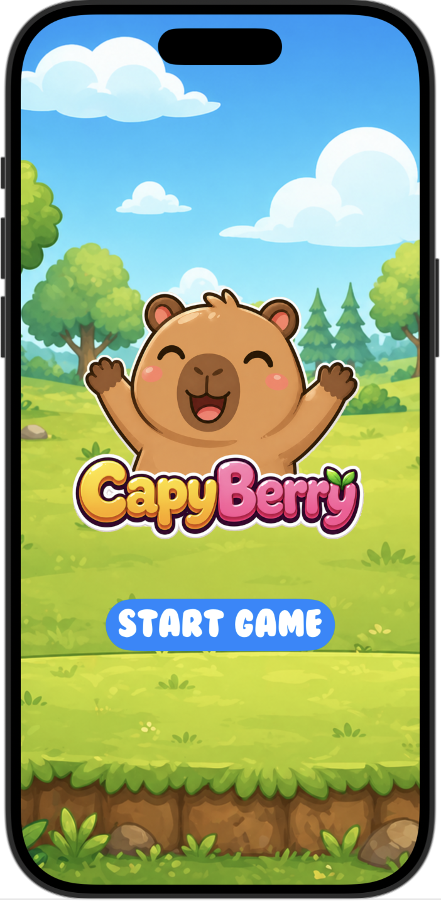
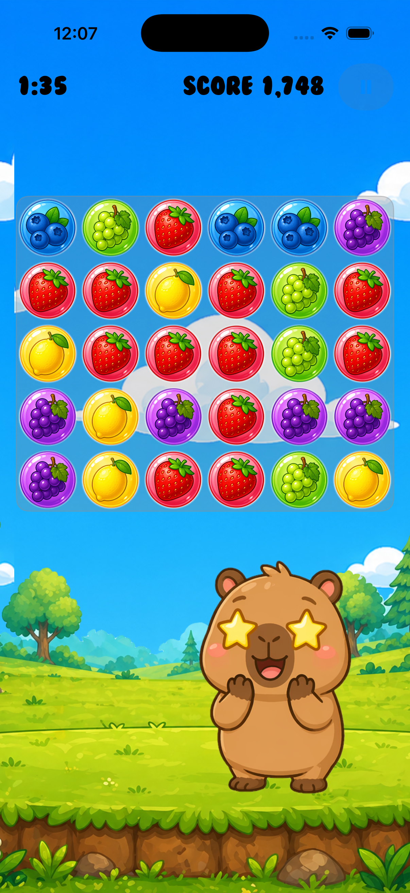
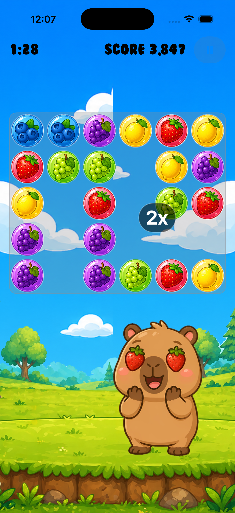

[](https://classroom.github.com/a/9DrT6EZJ)

# CapyBerry

A casual, mobile puzzle game where a capybara gathers fruit by matching orbs. Inspired by Puzzles & Dragons, CapyBerry challenges you to plan routes, drag to swap orbs, and chain big combos before the timer runs out.

- Fast, satisfying match mechanics
- Score multipliers for larger groups and multi-combo chains
- 2-minute sessions perfect for quick play

## Table of Contents
- [Quick Start](#quick-start)
- [How to Play](#how-to-play)
- [Game Mechanics](#game-mechanics)
- [Visual Mechanics](#visual-mechanics)
- [Screenshots](#screenshots)
- [Add Your Own Screenshots (How-To)](#add-your-own-screenshots-how-to)
- [Scoring](#scoring)
- [Tech & Requirements](#tech--requirements)
- [Roadmap / Future Features](#roadmap--future-features)
- [Contributing](#contributing)
- [License](#license)

## Quick Start
When you launch the app, tap the "Start Game" button to jump into the Gameplay screen.

## How to Play
- Drag an orb across the board to move it. As you drag, it swaps with adjacent orbs in the direction you move.
- You have limited stamina time for a single drag, shown by a circular indicator around your touch.
- Release to finalize the board and let matches resolve.
- Chain as many matches as you can before the round timer ends.

## Game Mechanics
- Drag-and-swap: Move one orb at a time; it will swap with neighbors along your drag path.
- Stamina-limited move: A visible stamina circle limits how long you can keep dragging.
- Matching: Groups of matching orbs clear and score points.
- Combos: Consecutive clears generated from one drag count as combos and increase your score multiplier.
- Round timer: The game ends after 2 minutes.

## Visual Mechanics
- Combo pop-ups change color at a 3x combo.
- After a 7x combo, pop-ups gain a rainbow effect and animation.
- The capybara avatar performs a random animation at every multiple of 3x combo.

## Screenshots
Placeholders are provided below. Replace the image paths with your own once you add screenshots to the repository (see the next section for instructions).

- Title Screen

  

- Puzzle Board

  

- Combo Popup

  

If you prefer fixed-width preview thumbnails that link to full-size images, use this HTML-style variant:

[](docs/screenshots/title-screen.png)

[](docs/screenshots/puzzle-board.png)

[](docs/screenshots/combo-popup.png)

## Add Your Own Screenshots (How-To)
Follow these steps to add images to this README:
1. Create a folder for images in your repo (recommended):
   - docs/screenshots/
2. Add your image files (PNG/JPEG/GIF) into that folder. Example file names:
   - docs/screenshots/title-screen.png
   - docs/screenshots/puzzle-board.png
   - docs/screenshots/combo-popup.png
3. Reference the images in Markdown:
   - Basic syntax (uses the image at its natural size):
     
     ```md
     

